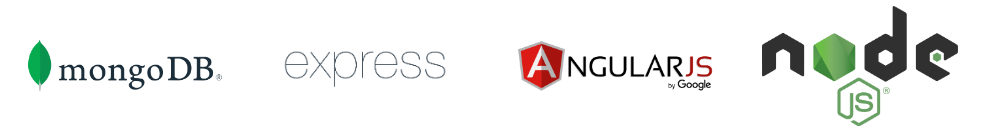

# MEAN App

> Aplicación creada con la integración de tecnologías que forman parte del Stack MEAN (MongoDB, ExpressJS, AngularJS y NodeJS).

### ¿Qué es Mean Stack?  
  

*MEAN es una estructura y un conjunto de tecnologías que nos permite desarrollar aplicaciones web dinámicas completas.Trabajándolas en algún stack en particular, en el caso de MEAN (MongoDB, ExpressJS, AngularJS y NodeJS) con tecnologías basadas en lenguaje Javascript.*

### Tecnologías utilizadas:

- [**HTML**](https://developer.mozilla.org/en-US/docs/Web/HTML): Lenguaje de marcado de hipertexto utilizado para crear sitios web de forma semántica.
- [**CSS**](https://developer.mozilla.org/en-US/docs/Web/CSS): Lenguaje de estilos que ayuda a mejorar la apariencia de documentos HTML o XML.
- [**Javascript**](https://developer.mozilla.org/en-US/docs/Web/JavaScript): Lenguaje de programación interpretado y ligero. Utilizado para multiples propósitos, uno de ellos dar interacción y dinamismo a sitios web.

- [**MongoDB**](https://www.mongodb.com/): *Gestor de base de datos que utiliza NoSQL (no relacional).*
- [**ExpressJS**](https://expressjs.com/es/): *Framework para trabajar con NodeJS.*
- [**AngularJS**](https://angularjs.org/): *Framework JavaScript para trabajar en la parte del Frontend.*
- [**NodeJS**](https://nodejs.org/en/): *Entorno de tiempo de ejecución para la capa del servidor basada en el lenguaje JavaScript.*